# --IN PROGRESS-- Project-4: House Price Prediction using various ML techniques :house_with_garden:	

<p align="center">
  
</p>

## Table of Contents
1. [Project Overview](#project-overview)
2. [Results Summary](#results-summary)
3. [Dataset](#dataset)
4. [Data Source](#data-source)
5. [Tech Stack](#tech-stack)
6. [Exploratory Data Analysis (EDA)](#exploratory-data-analysis-eda)
7. [Data Visualizations](#data-visualizations)
8. [Machine Learning Modeling](#machine-learning-modeling)
9. [Blending All Models](#blending-all-models)
10. [Evaluation and Submissions](#evaluation-and-submissions)
11. [Conclusion](#Conclusion)

## Project Overview
This project focuses on developing a predictive model for housing prices using various machine learning techniques. The primary goal is to **accurately predict house sales prices based on a comprehensive dataset that includes numerous features related to property characteristics** such as area, quality, condition, and location.

## Results Summary

Several models were explored and evaluated for their effectiveness in predicting house prices. 

**Key Results**
- **Model Comparison:** The models were evaluated based on the **Root Mean Square Error (RMSE)**, with the *Gradient Boosting, Lasso Regression and Random Forest models* showing particularly promising results.
- **Feature Importance:** Analysis revealed that certain features, such as *OverallQual and GrLivArea*, were highly predictive of house prices, guiding feature selection and engineering efforts.
- **Optimization:** **Parameter tuning was performed**, particularly for the *Random Forest and Gradient Boosting models*, to enhance model accuracy and efficiency.

## Key Insights
1. **Feature Correlation with SalePrice:**
- The EDA revealed **significant correlations between SalePrice and certain features like OverallQual (overall material and finish quality), GrLivArea (above grade living area square feet), and GarageCars (size of garage in car capacity).** This insight informed the selection of features and emphasized the importance of these variables in the regression models. Models like Lasso Regression and Gradient Boosting were configured to focus on such highly correlated features to improve accuracy.

2. **Distribution of Target Variable (SalePrice):**
- **The distribution of SalePrice was analyzed, showing a skewed pattern.** This prompted the use of logarithmic transformations of SalePrice during model training and validation to normalize the distribution and improve model performance, a technique evident in the RMSE calculations where logarithmic errors were used.

3. **Missing Values and Data Completeness:**
- During the EDA, **missing values were identified in several features.** Handling these missing values through imputation (filling missing values with the mean for numerical features) was critical for preparing the dataset for modeling. This was especially important for models that do not inherently handle missing values, like Lasso and Gradient Boosting.

4. **Impact of Feature Quality on Price:**
- Visualizations such as **box plots of SalePrice across different levels of OverallQual demonstrated a clear positive relationship between property quality and price.** This insight was used to prioritize features reflecting property quality in model training, influencing the selection of features in models and the interpretation of model coefficients in Lasso Regression.

5. **Outlier Detection:**
- EDA included analysis and visualization of potential outliers, particularly in key features like GrLivArea. **The presence of outliers influenced the decision to use models robust to outliers.** Gradient Boosting, for example, can handle outliers better than some other algorithms due to its sequential approach that focuses on correcting previous errors, including those potentially caused by outliers.

## Performance Table

| **ML Technique**  | **RMSE Error** |
| ------------- | ------------- |
| Lasso Regression Model  | 0.1540  |
| Random Forest Model  | 0.1540  |
| Gradient Boosting Model  | 0.1431  |
| Linear Regression Model  | 0.1897  |
| Decision Tree Regressor Model  | 0.2103  |
| Random Forest Regressor Model  | 0.1546  |
| Support Vector Regression (SVR) Model  | 0.4021  |
| K-Nearest Neighbors Regressor Model  | 0.2006  |
| Simple Average Blend  | 0.1631  |

<p align="left">
  
</p>

### Model Summary with RMSE Error

1. **Gradient Boosting Model (0.1431):**
- **Performance:** Best performing model.
- **Interpretation:** This model has the lowest RMSE, indicating it has the best predictive accuracy among the models listed. Gradient Boosting effectively handles both linear and non-linear relationships by building an ensemble of weak prediction models, typically decision trees.

2. **Lasso Regression Model (0.1540):**
- **Performance:** Joint second best with Random Forest.
- **Interpretation:** Lasso (Least Absolute Shrinkage and Selection Operator) performs both variable selection and regularization to enhance the prediction accuracy. Its performance is strong, especially considering it helps in reducing overfitting in models with many features.

3. **Random Forest Model (0.1540) and Random Forest Regressor Model (0.1546):**
- **Performance:** Very close to Lasso, almost identical RMSE for one variant.
- **Interpretation:** Shows robust performance, slightly varied between implementations. Random Forest is effective due to its method of averaging multiple deep decision trees, trained on different parts of the same training set, which reduces overfitting and variance.

4. **Simple Average Blend (0.1631):**
- **Performance:** Mid-tier performance.
- **Interpretation:** This technique involves averaging the predictions of multiple models. It's a straightforward ensemble method that can yield decent results by blending different model outputs, reducing variance but not always capturing complex patterns effectively.

5. **Linear Regression Model (0.1897):**
- **Performance:** Lower middle performance.
- **Interpretation:** Shows moderate predictive power. Linear regression assumes a linear relationship between features and the target variable, which might not always hold true in complex datasets like house pricing, explaining the higher RMSE.

6. **K-Nearest Neighbours Regressor Model (0.2006):**
- **Performance:** Lower performance.
- **Interpretation:** This model uses feature similarity to predict values of new data points, which indicates it may struggle with high dimensional data or where feature scaling is not adequately managed.

7. **Decision Tree Regressor Model (0.2103):**
- **Performance:** Lower performance among tree-based models.
- **Interpretation:** Prone to overfitting, especially without adequate depth constraints or pruning. Decision Trees can capture complex patterns but often don’t generalize well.

8. **Support Vector Regression (SVR) Model (0.4021):**
- **Performance:** Worst performance.
- **Interpretation:** This model, especially with default settings, may not perform well with large data sets or when features influencing the target are nonlinear. Its high RMSE suggests that it might not have captured the complex relationships in the data effectively.

## Dataset
The datasets utilized in this project contains detailed information on residential home sales reported in **Ames, Iowa**. Datasets are broken up into two parts: **train and test**.

### 1. Train Dataset Analysis

**The train.csv dataset includes data on 1,460 properties, described by 81 features.** Here are some key insights and observations:

**General Structure**
- **Total Entries:** 1,460
- **Total Features:** 81, including a wide range of property characteristics such as zoning, lot size, street type, building type, quality and condition ratings, and many more detailed attributes related to the property’s interior and exterior.

**Notable Features**
- **SalePrice:** The target variable for prediction, with values ranging from **$34,900 to $755,000**, and a mean of approximately **$180,921**.

- **MSSubClass, MSZoning, and Neighborhood:** These features categorize properties by type, zoning, and location within Ames, Iowa.

- **YearBuilt and YearRemodAdd:** Indicating the age of the property and the last remodeling year.
- **OverallQual and OverallCond:** Rating scales from 1 to 10 that assess the overall material and finish quality, and the overall condition of the property.
- **TotalBsmtSF and GrLivArea:** Key area measurements in square feet for basement and above-ground living area.

**Categorical and Numeric Distribution**
- Many features are **categorical** (e.g., Street, LotShape, Utilities), requiring encoding for machine learning applications.
- **Numeric** data spans across discrete and continuous variables, with different scales and distributions, which may need standardization or normalization.

**Display the first five rows of the DataFrame train_df**

```ruby
train_df.head()
```
<table border="1" class="dataframe">
  <thead>
    <tr style="text-align: right;">
      <th></th>
      <th>Id</th>
      <th>MSSubClass</th>
      <th>MSZoning</th>
      <th>LotFrontage</th>
      <th>LotArea</th>
      <th>Street</th>
      <th>Alley</th>
      <th>LotShape</th>
      <th>LandContour</th>
      <th>Utilities</th>
      <th>...</th>
      <th>PoolArea</th>
      <th>PoolQC</th>
      <th>Fence</th>
      <th>MiscFeature</th>
      <th>MiscVal</th>
      <th>MoSold</th>
      <th>YrSold</th>
      <th>SaleType</th>
      <th>SaleCondition</th>
      <th>SalePrice</th>
    </tr>
  </thead>
  <tbody>
    <tr>
      <th>0</th>
      <td>1</td>
      <td>60</td>
      <td>RL</td>
      <td>65.0</td>
      <td>8450</td>
      <td>Pave</td>
      <td>NaN</td>
      <td>Reg</td>
      <td>Lvl</td>
      <td>AllPub</td>
      <td>...</td>
      <td>0</td>
      <td>NaN</td>
      <td>NaN</td>
      <td>NaN</td>
      <td>0</td>
      <td>2</td>
      <td>2008</td>
      <td>WD</td>
      <td>Normal</td>
      <td>208500</td>
    </tr>
    <tr>
      <th>1</th>
      <td>2</td>
      <td>20</td>
      <td>RL</td>
      <td>80.0</td>
      <td>9600</td>
      <td>Pave</td>
      <td>NaN</td>
      <td>Reg</td>
      <td>Lvl</td>
      <td>AllPub</td>
      <td>...</td>
      <td>0</td>
      <td>NaN</td>
      <td>NaN</td>
      <td>NaN</td>
      <td>0</td>
      <td>5</td>
      <td>2007</td>
      <td>WD</td>
      <td>Normal</td>
      <td>181500</td>
    </tr>
    <tr>
      <th>2</th>
      <td>3</td>
      <td>60</td>
      <td>RL</td>
      <td>68.0</td>
      <td>11250</td>
      <td>Pave</td>
      <td>NaN</td>
      <td>IR1</td>
      <td>Lvl</td>
      <td>AllPub</td>
      <td>...</td>
      <td>0</td>
      <td>NaN</td>
      <td>NaN</td>
      <td>NaN</td>
      <td>0</td>
      <td>9</td>
      <td>2008</td>
      <td>WD</td>
      <td>Normal</td>
      <td>223500</td>
    </tr>
    <tr>
      <th>3</th>
      <td>4</td>
      <td>70</td>
      <td>RL</td>
      <td>60.0</td>
      <td>9550</td>
      <td>Pave</td>
      <td>NaN</td>
      <td>IR1</td>
      <td>Lvl</td>
      <td>AllPub</td>
      <td>...</td>
      <td>0</td>
      <td>NaN</td>
      <td>NaN</td>
      <td>NaN</td>
      <td>0</td>
      <td>2</td>
      <td>2006</td>
      <td>WD</td>
      <td>Abnorml</td>
      <td>140000</td>
    </tr>
    <tr>
      <th>4</th>
      <td>5</td>
      <td>60</td>
      <td>RL</td>
      <td>84.0</td>
      <td>14260</td>
      <td>Pave</td>
      <td>NaN</td>
      <td>IR1</td>
      <td>Lvl</td>
      <td>AllPub</td>
      <td>...</td>
      <td>0</td>
      <td>NaN</td>
      <td>NaN</td>
      <td>NaN</td>
      <td>0</td>
      <td>12</td>
      <td>2008</td>
      <td>WD</td>
      <td>Normal</td>
      <td>250000</td>
    </tr>
  </tbody>
</table>
<p>5 rows × 81 columns</p>
</div>

### 2. Test Dataset Analysis

The test dataset includes data on **1,459 properties with the same 80 features** as in the train dataset (excluding *SalePrice*). Here are some key observations:

**General Structure**
- **Total Entries:** 1,459

- **Total Features:** 80 (one less than the train set due to the absence of the target variable SalePrice).

**Display basic information for both train and test data**

```ruby
print(train_df.info())
print("***Train dataset shape is {}***".format(train_df.shape))
```
```python
<class 'pandas.core.frame.DataFrame'>
RangeIndex: 1460 entries, 0 to 1459
Data columns (total 81 columns):
 #   Column         Non-Null Count  Dtype  
---  ------         --------------  -----  
 0   Id             1460 non-null   int64  
 1   MSSubClass     1460 non-null   int64  
 2   MSZoning       1460 non-null   object 
 3   LotFrontage    1201 non-null   float64
 4   LotArea        1460 non-null   int64  
 5   Street         1460 non-null   object 
 6   Alley          91 non-null     object 
 7   LotShape       1460 non-null   object 
 8   LandContour    1460 non-null   object 
 9   Utilities      1460 non-null   object 
 10  LotConfig      1460 non-null   object 
 11  LandSlope      1460 non-null   object 
 12  Neighborhood   1460 non-null   object 
 13  Condition1     1460 non-null   object 
 14  Condition2     1460 non-null   object 
 15  BldgType       1460 non-null   object 
 16  HouseStyle     1460 non-null   object 
 17  OverallQual    1460 non-null   int64  
 18  OverallCond    1460 non-null   int64  
 19  YearBuilt      1460 non-null   int64  
 20  YearRemodAdd   1460 non-null   int64  
 21  RoofStyle      1460 non-null   object 
 22  RoofMatl       1460 non-null   object 
 23  Exterior1st    1460 non-null   object 
 24  Exterior2nd    1460 non-null   object 
 25  MasVnrType     588 non-null    object 
 26  MasVnrArea     1452 non-null   float64
 27  ExterQual      1460 non-null   object 
 28  ExterCond      1460 non-null   object 
 29  Foundation     1460 non-null   object 
 30  BsmtQual       1423 non-null   object 
 31  BsmtCond       1423 non-null   object 
 32  BsmtExposure   1422 non-null   object 
 33  BsmtFinType1   1423 non-null   object 
 34  BsmtFinSF1     1460 non-null   int64  
 35  BsmtFinType2   1422 non-null   object 
 36  BsmtFinSF2     1460 non-null   int64  
 37  BsmtUnfSF      1460 non-null   int64  
 38  TotalBsmtSF    1460 non-null   int64  
 39  Heating        1460 non-null   object 
 40  HeatingQC      1460 non-null   object 
 41  CentralAir     1460 non-null   object 
 42  Electrical     1459 non-null   object 
 43  1stFlrSF       1460 non-null   int64  
 44  2ndFlrSF       1460 non-null   int64  
 45  LowQualFinSF   1460 non-null   int64  
 46  GrLivArea      1460 non-null   int64  
 47  BsmtFullBath   1460 non-null   int64  
 48  BsmtHalfBath   1460 non-null   int64  
 49  FullBath       1460 non-null   int64  
 50  HalfBath       1460 non-null   int64  
 51  BedroomAbvGr   1460 non-null   int64  
 52  KitchenAbvGr   1460 non-null   int64  
 53  KitchenQual    1460 non-null   object 
 54  TotRmsAbvGrd   1460 non-null   int64  
 55  Functional     1460 non-null   object 
 56  Fireplaces     1460 non-null   int64  
 57  FireplaceQu    770 non-null    object 
 58  GarageType     1379 non-null   object 
 59  GarageYrBlt    1379 non-null   float64
 60  GarageFinish   1379 non-null   object 
 61  GarageCars     1460 non-null   int64  
 62  GarageArea     1460 non-null   int64  
 63  GarageQual     1379 non-null   object 
 64  GarageCond     1379 non-null   object 
 65  PavedDrive     1460 non-null   object 
 66  WoodDeckSF     1460 non-null   int64  
 67  OpenPorchSF    1460 non-null   int64  
 68  EnclosedPorch  1460 non-null   int64  
 69  3SsnPorch      1460 non-null   int64  
 70  ScreenPorch    1460 non-null   int64  
 71  PoolArea       1460 non-null   int64  
 72  PoolQC         7 non-null      object 
 73  Fence          281 non-null    object 
 74  MiscFeature    54 non-null     object 
 75  MiscVal        1460 non-null   int64  
 76  MoSold         1460 non-null   int64  
 77  YrSold         1460 non-null   int64  
 78  SaleType       1460 non-null   object 
 79  SaleCondition  1460 non-null   object 
 80  SalePrice      1460 non-null   int64  
dtypes: float64(3), int64(35), object(43)
memory usage: 924.0+ KB
None
```

### Summary and Insights 

Both the train and test datasets are quite consistent in terms of the types of features and data quality issues (e.g., missing values). **The test set lacks the SalePrice feature** since it's meant for making predictions in a typical modeling task.

**These are the features provide a nuanced view of each home's attributes, contributing significantly to the model's predictive capabilities.**

- **OverallQual**: Overall material and finish quality
- **GrLivArea**: Above grade (ground) living area square feet
- **GarageCars**: Size of garage in car capacity
- **TotalBsmtSF**: Total square feet of basement area
- **FullBath**: Full bathrooms above grade

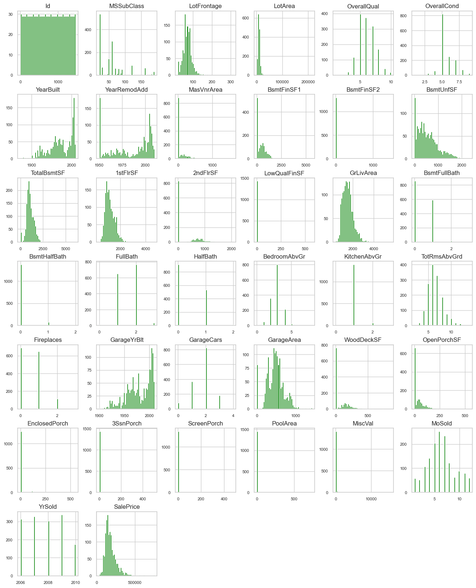


## Data Source
| Data Source  | Description |
| ------------- | ------------- |
| [House Prices - Advanced Regression Techniques](https://www.kaggle.com/competitions/house-prices-advanced-regression-techniques)  | Predict sales prices and practice feature engineering, RFs, and gradient boosting  |

## Tech Stack
| Name  | Usage |
| ------------- | ------------- |
|  | Data manipulation and analysis  |
|  | Numerical computations  |
|  | 2D plotting  |
|  | Machine learning library   |
|  | Library for creating statistical graphics and visualizing data  |
|  | Visual analytics platform  |
|  | Hosted Jupyter Notebook service  |
|  | Presentation program  |
|  | Developer platform  |

## Exploratory Data Analysis (EDA)

**Check distribution of target variable**
```ruby
print(train_df['SalePrice'].describe())
```
```python
count      1460.000000
mean     180921.195890
std       79442.502883
min       34900.000000
25%      129975.000000
50%      163000.000000
75%      214000.000000
max      755000.000000
Name: SalePrice, dtype: float64
```

**List quantitative fields**
```ruby
print(quantitative)
```
```python
['MSSubClass', 'LotFrontage', 'LotArea', 'OverallQual', 'OverallCond', 'YearBuilt', 'YearRemodAdd', 'MasVnrArea', 'BsmtFinSF1', 'BsmtFinSF2', 'BsmtUnfSF', 'TotalBsmtSF', '1stFlrSF', '2ndFlrSF', 'LowQualFinSF', 'GrLivArea', 'BsmtFullBath', 'BsmtHalfBath', 'FullBath', 'HalfBath', 'BedroomAbvGr', 'KitchenAbvGr', 'TotRmsAbvGrd', 'Fireplaces', 'GarageYrBlt', 'GarageCars', 'GarageArea', 'WoodDeckSF', 'OpenPorchSF', 'EnclosedPorch', '3SsnPorch', 'ScreenPorch', 'PoolArea', 'MiscVal', 'MoSold', 'YrSold']
```

**List qualitative fields**
```ruby
print(qualitative)
```
```python
['MSZoning', 'Street', 'Alley', 'LotShape', 'LandContour', 'Utilities', 'LotConfig', 'LandSlope', 'Neighborhood', 'Condition1', 'Condition2', 'BldgType', 'HouseStyle', 'RoofStyle', 'RoofMatl', 'Exterior1st', 'Exterior2nd', 'MasVnrType', 'ExterQual', 'ExterCond', 'Foundation', 'BsmtQual', 'BsmtCond', 'BsmtExposure', 'BsmtFinType1', 'BsmtFinType2', 'Heating', 'HeatingQC', 'CentralAir', 'Electrical', 'KitchenQual', 'Functional', 'FireplaceQu', 'GarageType', 'GarageFinish', 'GarageQual', 'GarageCond', 'PavedDrive', 'PoolQC', 'Fence', 'MiscFeature', 'SaleType', 'SaleCondition']
```

**Check for missing values**
```ruby
print(train_df.isnull().sum())
```

```python
Id                 0
MSSubClass         0
MSZoning           0
LotFrontage      259
LotArea            0
                ... 
MoSold             0
YrSold             0
SaleType           0
SaleCondition      0
SalePrice          0
Length: 81, dtype: int64
```

**Number of unique values in each column**
```ruby
print(train_df.nunique())
```
```python
Id               1460
MSSubClass         15
MSZoning            5
LotFrontage       110
LotArea          1073
                 ... 
MoSold             12
YrSold              5
SaleType            9
SaleCondition       6
SalePrice         663
Length: 81, dtype: int64
```

## Data Visualizations

**Please visit our Tableau Public website via the link below to access additional data visualizations related to the project.**
[House Prediction Data Visualizations on Tableau Public](https://public.tableau.com/app/profile/dawn.reynoso/viz/Project4Group3-final/HousePriceOverallCondition?publish=yes).

**Histograms for each numerical column, *train* dataset**

```ruby
train_df.hist(figsize=(16, 20), bins=50, xlabelsize=8, ylabelsize=8, color='green');
```


**Histograms for each numerical column, *test* dataset**
```ruby
test_df.hist(figsize=(16, 20), bins=50, xlabelsize=8, ylabelsize=8);
```


**Histogram of SalePrice**
```ruby
# Load the dataset
data = pd.read_csv('train.csv')

plt.figure(figsize=(10, 6))
sns.histplot(train_df['SalePrice'], kde=True)
plt.title('Distribution of Sale Prices')
plt.xlabel('Sale Price')
plt.ylabel('Frequency')
plt.show()
```

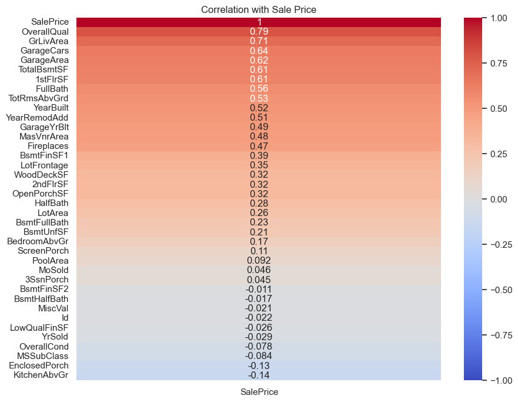

**Boxplot of SalePrice by OverallQual**
```ruby
# Load the dataset
data = pd.read_csv('train.csv')

plt.figure(figsize=(10, 6))
sns.boxplot(x='OverallQual', y='SalePrice', data=train_df)
plt.title('Sale Price by Overall Quality')
plt.xlabel('Overall Quality')
plt.ylabel('Sale Price')
plt.show()
```


**Correlation matrix**
```ruby
# Load the dataset
data = pd.read_csv('train.csv')

numerical_cols = train_df.select_dtypes(include=[np.number])
correlation_matrix = numerical_cols.corr()

# Generate the heatmap
plt.figure(figsize=(12, 10))
sns.heatmap(correlation_matrix, annot=False, cmap='coolwarm')
plt.title('Feature Correlation Matrix')
plt.show()
```


**Pairplot for selected features**
```ruby
# Load the dataset
data = pd.read_csv('train.csv')

sns.pairplot(train_df[['SalePrice', 'OverallQual', 'GrLivArea', 'GarageCars']])
plt.show()
```

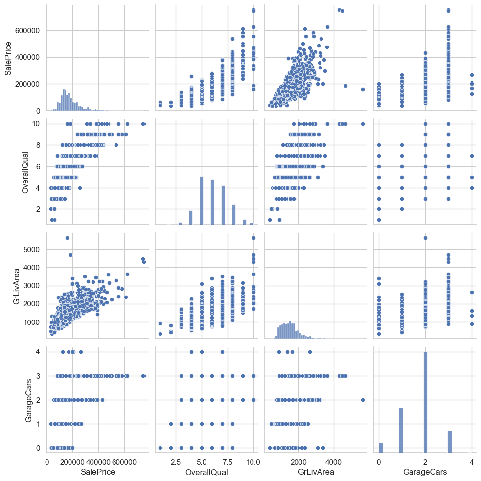

**Scatter Plot of TotalBsmtSF vs 1stFlrSF**
```ruby
test_df = pd.read_csv('test.csv')

# Set plot style
sns.set(style="whitegrid")

# Scatter Plot of TotalBsmtSF vs 1stFlrSF
plt.figure(figsize=(8, 6))
sns.scatterplot(data=data, x='TotalBsmtSF', y='1stFlrSF')
plt.title('Scatter plot of TotalBsmtSF vs. 1stFlrSF')
plt.xlabel('Total Basement Area (sq ft)')
plt.ylabel('First Floor Area (sq ft)')
plt.show()
```


**Scatter Plot of YearBuilt vs GrLivArea**
```ruby
test_df = pd.read_csv('test.csv')

# Set plot style
sns.set(style="whitegrid")

# Scatter Plot of YearBuilt vs GrLivArea
plt.figure(figsize=(8, 6))
sns.scatterplot(data=data, x='YearBuilt', y='GrLivArea')
plt.title('Scatter plot of YearBuilt vs. GrLivArea')
plt.xlabel('Year Built')
plt.ylabel('Ground Living Area (sq ft)')
plt.show()
```


**Display summary statistics**
```ruby
# Load the test CSV file
data = pd.read_csv('test.csv')

# Display summary statistics
summary = data.describe()

# Print the summary
print(summary)
```
```python
                Id   MSSubClass  LotFrontage       LotArea  OverallQual  \
count  1459.000000  1459.000000  1232.000000   1459.000000  1459.000000   
mean   2190.000000    57.378341    68.580357   9819.161069     6.078821   
std     421.321334    42.746880    22.376841   4955.517327     1.436812   
min    1461.000000    20.000000    21.000000   1470.000000     1.000000   
25%    1825.500000    20.000000    58.000000   7391.000000     5.000000   
50%    2190.000000    50.000000    67.000000   9399.000000     6.000000   
75%    2554.500000    70.000000    80.000000  11517.500000     7.000000   
max    2919.000000   190.000000   200.000000  56600.000000    10.000000   

       OverallCond    YearBuilt  YearRemodAdd   MasVnrArea   BsmtFinSF1  ...  \
count  1459.000000  1459.000000   1459.000000  1444.000000  1458.000000  ...   
mean      5.553804  1971.357779   1983.662783   100.709141   439.203704  ...   
std       1.113740    30.390071     21.130467   177.625900   455.268042  ...   
min       1.000000  1879.000000   1950.000000     0.000000     0.000000  ...   
25%       5.000000  1953.000000   1963.000000     0.000000     0.000000  ...   
50%       5.000000  1973.000000   1992.000000     0.000000   350.500000  ...   
75%       6.000000  2001.000000   2004.000000   164.000000   753.500000  ...   
max       9.000000  2010.000000   2010.000000  1290.000000  4010.000000  ...   

        GarageArea   WoodDeckSF  OpenPorchSF  EnclosedPorch    3SsnPorch  \
count  1458.000000  1459.000000  1459.000000    1459.000000  1459.000000   
mean    472.768861    93.174777    48.313914      24.243317     1.794380   
std     217.048611   127.744882    68.883364      67.227765    20.207842   
min       0.000000     0.000000     0.000000       0.000000     0.000000   
25%     318.000000     0.000000     0.000000       0.000000     0.000000   
50%     480.000000     0.000000    28.000000       0.000000     0.000000   
75%     576.000000   168.000000    72.000000       0.000000     0.000000   
max    1488.000000  1424.000000   742.000000    1012.000000   360.000000   

       ScreenPorch     PoolArea       MiscVal       MoSold       YrSold  
count  1459.000000  1459.000000   1459.000000  1459.000000  1459.000000  
mean     17.064428     1.744345     58.167923     6.104181  2007.769705  
std      56.609763    30.491646    630.806978     2.722432     1.301740  
min       0.000000     0.000000      0.000000     1.000000  2006.000000  
25%       0.000000     0.000000      0.000000     4.000000  2007.000000  
50%       0.000000     0.000000      0.000000     6.000000  2008.000000  
75%       0.000000     0.000000      0.000000     8.000000  2009.000000  
max     576.000000   800.000000  17000.000000    12.000000  2010.000000  

[8 rows x 37 columns]
```

## Machine Learning Modeling

Each model's **predictive power is assessed by calculating the RMSE on the validation dataset**, which quantifies the average magnitude of the model's prediction errors. 

**A lower RMSE indicates better predictive accuracy.**

The systematic approach to tuning model parameters (like **alpha for Lasso and n_estimators for Gradient Boosting**) and its comprehensive validation demonstrate an effective use of scikit-learn's capabilities to optimize model performance.


**8 Machine Learning Algorithms were ran in this project.**

- **Supervised**
    - Linear Regression / Decision Tree Regressor / Lasso Regression / Support Vector Regression / K-Nearest Neighbors Regressor
- **Ensemble Method**
    - Random Forest Regressor / Random Forest / Gradient Boosting
- **Other Method**
    - Simple Average Blend


**Lasso Regression Model**
```ruby
# Load the data
train_df = pd.read_csv('train.csv')
test_df = pd.read_csv('test.csv')

# Data preparation
features = train_df.select_dtypes(include=[np.number]).drop(['Id', 'SalePrice'], axis=1).columns
mean_values = train_df[features].mean()  # Calculate mean only for numeric features
X = train_df[features].fillna(mean_values)  # Fill missing values with the calculated mean
y = train_df['SalePrice']

# Splitting data for training and validation
X_train, X_val, y_train, y_val = train_test_split(X, y, test_size=0.2, random_state=42)

# Model initialization and training
model = Lasso(alpha=.01, random_state=42)  # alpha is a tuning parameter affecting how penalty is applied
model.fit(X_train, y_train)

# Predicting test data
test_features = test_df[features].fillna(mean_values)  # Use the same mean values for filling test data
test_predictions = model.predict(test_features)

# Create submission file
submission = pd.DataFrame({'Id': test_df['Id'], 'SalePrice': test_predictions})
submission.to_csv('submission_lasso_regression.csv', index=False)

# Calculating RMSE using logarithms
log_rmse = np.sqrt(mean_squared_error(np.log(y_val), np.log(predictions_val)))
print(f'Validation RMSE (logarithmic scale): {log_rmse}')

Validation RMSE (logarithmic scale): 0.15404594833283894
```

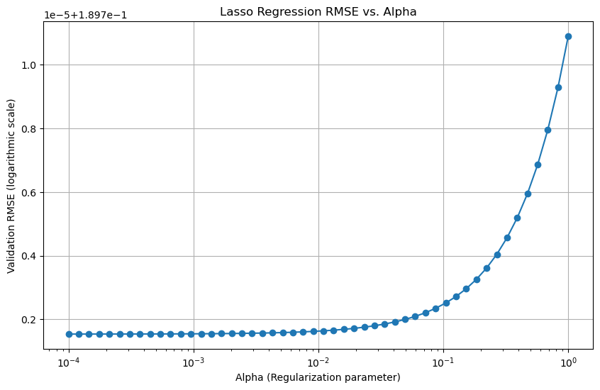

**Random Forest Model**
```ruby
# Load the data
train_df = pd.read_csv('train.csv')
test_df = pd.read_csv('test.csv')

# Prepare data
X = train_df.drop(['Id', 'SalePrice'], axis=1).select_dtypes(include=[np.number]).fillna(0)
y = train_df['SalePrice']

# Splitting data for training and validation
X_train, X_val, y_train, y_val = train_test_split(X, y, test_size=0.2, random_state=42)

# Initialize and train model with more detailed logging
n_trees = [10, 50, 100, 200, 300, 400, 500]  # Different values for the number of trees
rmse_scores = []

for n in n_trees:
    model = RandomForestRegressor(n_estimators=n, random_state=42, oob_score=True)
    model.fit(X_train, y_train)
    oob_rmse = np.sqrt(mean_squared_error(np.log(y_val), np.log(model.predict(X_val))))
    rmse_scores.append(oob_rmse)
    print(f'OOB RMSE with {n} trees: {oob_rmse}')

# Plotting RMSE against the number of trees
plt.figure(figsize=(10, 6))
plt.plot(n_trees, rmse_scores, marker='o')
plt.xlabel('Number of Trees')
plt.ylabel('Validation RMSE (logarithmic scale)')
plt.title('Random Forest Regression RMSE vs. Number of Trees')
plt.grid(True)
plt.show()

# Continue with the best n_estimator based on previous RMSE results
best_n_estimator = n_trees[rmse_scores.index(min(rmse_scores))]
model = RandomForestRegressor(n_estimators=best_n_estimator, random_state=42)
model.fit(X_train, y_train)

# Predict on validation and test data
predictions_val = model.predict(X_val)
test_features = test_df.drop('Id', axis=1).select_dtypes(include=[np.number]).fillna(0)
test_predictions = model.predict(test_features)

# RMSE for the best model
log_rmse = np.sqrt(mean_squared_error(np.log(y_val), np.log(predictions_val)))
print(f'Best Model Validation RMSE (logarithmic scale): {log_rmse}')

# Create submission file
submission = pd.DataFrame({'Id': test_df['Id'], 'SalePrice': test_predictions})
submission.to_csv('submission_random_forest.csv', index=False)

OOB RMSE with 10 trees: 0.16602181485865006
OOB RMSE with 50 trees: 0.15446243375941687
OOB RMSE with 100 trees: 0.15412655555084592
OOB RMSE with 200 trees: 0.15437734088082378
OOB RMSE with 300 trees: 0.15404594833283894
OOB RMSE with 400 trees: 0.15407258710041102
OOB RMSE with 500 trees: 0.15425770387121085
```

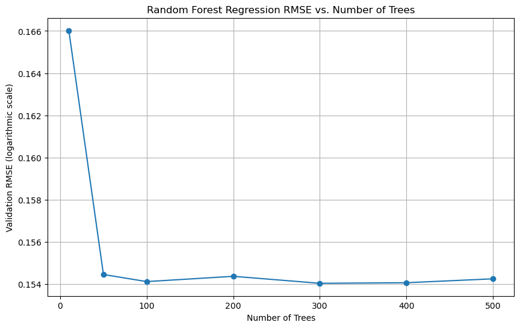

**Gradient Boosting Model**
```ruby
# Load the data
train_df = pd.read_csv('train.csv')
test_df = pd.read_csv('test.csv')

# Data preparation
features = train_df.select_dtypes(include=[np.number]).drop(['Id', 'SalePrice'], axis=1).columns
mean_values = train_df[features].mean()
X = train_df[features].fillna(mean_values)
y = train_df['SalePrice']

# Splitting data for training and validation
X_train, X_val, y_train, y_val = train_test_split(X, y, test_size=0.2, random_state=42)

# Initialize variables for plotting
n_estimators_range = range(10, 101, 10)  # Testing with 10, 20, ..., 100 estimators
rmse_scores = []

# Model training with incremental number of estimators
for n_estimators in n_estimators_range:
    model = GradientBoostingRegressor(n_estimators=n_estimators, learning_rate=0.1, max_depth=3, random_state=42)
    model.fit(X_train, y_train)
    predictions_val = model.predict(X_val)
    log_rmse = np.sqrt(mean_squared_error(np.log(y_val), np.log(predictions_val)))
    rmse_scores.append(log_rmse)
    print(f'Validation RMSE with {n_estimators} estimators: {log_rmse}')

# Plotting RMSE against the number of estimators
plt.figure(figsize=(10, 6))
plt.plot(n_estimators_range, rmse_scores, marker='o')
plt.xlabel('Number of Estimators')
plt.ylabel('Validation RMSE (logarithmic scale)')
plt.title('Gradient Boosting Regression RMSE vs. Number of Estimators')
plt.grid(True)
plt.show()

# Continue with the best model (optional, here assumed 100 as default)
model = GradientBoostingRegressor(n_estimators=100, learning_rate=0.1, max_depth=3, random_state=42)
model.fit(X_train, y_train)

# Predicting validation and test data
predictions_val = model.predict(X_val)
test_features = test_df[features].fillna(mean_values)
test_predictions = model.predict(test_features)

# Calculate final RMSE for the best model
log_rmse = np.sqrt(mean_squared_error(np.log(y_val), np.log(predictions_val)))
print(f'Final Model Validation RMSE (logarithmic scale): {log_rmse}')

# Create submission file
submission = pd.DataFrame({'Id': test_df['Id'], 'SalePrice': test_predictions})
submission.to_csv('submission_gradient_boosting.csv', index=False)

Validation RMSE with 10 estimators: 0.2682241739221871
Validation RMSE with 20 estimators: 0.2056552874557367
Validation RMSE with 30 estimators: 0.1763117248892716
Validation RMSE with 40 estimators: 0.159752564489652
Validation RMSE with 50 estimators: 0.15053158286110857
Validation RMSE with 60 estimators: 0.14731065097310198
Validation RMSE with 70 estimators: 0.1459401441930658
Validation RMSE with 80 estimators: 0.14478862706074833
Validation RMSE with 90 estimators: 0.14378061934064096
Validation RMSE with 100 estimators: 0.14306673994166472
```

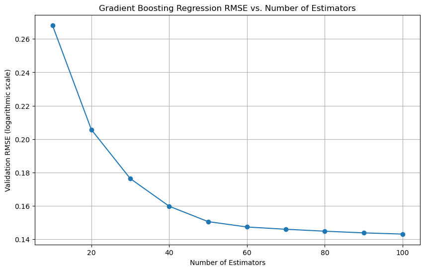

**Linear Regression Model**
```ruby
# Load data
train_df = pd.read_csv('train.csv')
test_df = pd.read_csv('test.csv')

# Prepare data
imputer = SimpleImputer(strategy='mean')
X = train_df.select_dtypes(include=[np.number]).drop(['Id', 'SalePrice'], axis=1)
y = train_df['SalePrice']
X_train, X_val, y_train, y_val = train_test_split(X, y, test_size=0.2, random_state=42)  # Split for validation

# Imputing missing values
X_train = imputer.fit_transform(X_train)
X_val = imputer.transform(X_val)
X_test = imputer.transform(test_df.select_dtypes(include=[np.number]).drop(['Id'], axis=1))

# Model training
model = LinearRegression()
model.fit(X_train, y_train)

# Prediction on validation set for RMSE calculation
predictions_val = model.predict(X_val)

# Calculating RMSE using logarithms
log_rmse = np.sqrt(mean_squared_error(np.log(y_val), np.log(predictions_val)))
print(f'Validation RMSE (logarithmic scale): {log_rmse}')

# Plotting residuals
residuals = y_val - predictions_val
plt.scatter(predictions_val, residuals)
plt.xlabel('Predicted Values')
plt.ylabel('Residuals')
plt.axhline(y=0, color='red', linestyle='--')
plt.title('Residual Plot of Linear Regression Model')
plt.show()

# Prediction on test set
predictions = model.predict(X_test)

# Save to CSV
submission = pd.DataFrame({'Id': test_df['Id'], 'SalePrice': predictions})
submission.to_csv('submission_linear_regression.csv', index=False)

Validation RMSE (logarithmic scale): 0.1896561896891731
```

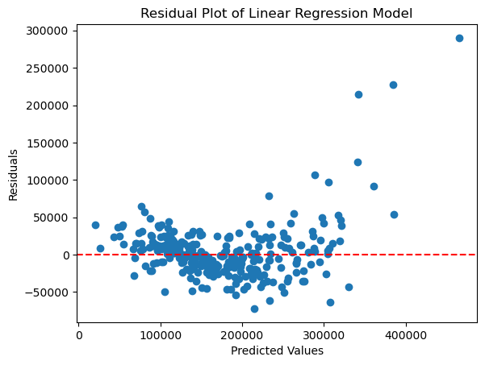

**Decision Tree Regressor Model**
```ruby
# Load data
train_df = pd.read_csv('train.csv')
test_df = pd.read_csv('test.csv')

# Prepare data
imputer = SimpleImputer(strategy='mean')
# Splitting the dataset into training and validation sets
X = train_df.select_dtypes(include=[np.number]).drop(['Id', 'SalePrice'], axis=1)
y = train_df['SalePrice']
X_train, X_val, y_train, y_val = train_test_split(X, y, test_size=0.2, random_state=42)

# Imputing missing values
X_train = imputer.fit_transform(X_train)
X_val = imputer.transform(X_val)
X_test = imputer.transform(test_df.select_dtypes(include=[np.number]).drop(['Id'], axis=1))

# Initialize variables for plotting
max_depths = range(1, 21)  # Testing depths from 1 to 20
rmse_scores = []

# Model training with different tree depths
for depth in max_depths:
    model = DecisionTreeRegressor(max_depth=depth, random_state=42)
    model.fit(X_train, y_train)
    predictions_val = model.predict(X_val)
    log_rmse = np.sqrt(mean_squared_error(np.log(y_val), np.log(predictions_val)))
    rmse_scores.append(log_rmse)
    print(f'Validation RMSE at depth {depth}: {log_rmse}')

# Plotting RMSE against tree depth
plt.figure(figsize=(10, 6))
plt.plot(max_depths, rmse_scores, marker='o')
plt.xlabel('Max Tree Depth')
plt.ylabel('Validation RMSE (logarithmic scale)')
plt.title('Decision Tree Regression RMSE vs. Tree Depth')
plt.grid(True)
plt.show()

# Continue with the best depth based on previous RMSE results
best_depth = max_depths[rmse_scores.index(min(rmse_scores))]
model = DecisionTreeRegressor(max_depth=best_depth, random_state=42)
model.fit(X_train, y_train)

# Prediction on validation and test data
predictions_val = model.predict(X_val)
predictions = model.predict(X_test)

# Calculate final RMSE for the best model
log_rmse = np.sqrt(mean_squared_error(np.log(y_val), np.log(predictions_val)))
print(f'Final Model Validation RMSE (logarithmic scale): {log_rmse}')

# Save to CSV
submission = pd.DataFrame({'Id': test_df['Id'], 'SalePrice': predictions})
submission.to_csv('submission_decision_tree.csv', index=False)

Validation RMSE at depth 1: 0.3521368836643087
Validation RMSE at depth 2: 0.28401379937465826
Validation RMSE at depth 3: 0.2481311654079464
Validation RMSE at depth 4: 0.2288337144508904
Validation RMSE at depth 5: 0.2103224178957704
Validation RMSE at depth 6: 0.21470401749596218
Validation RMSE at depth 7: 0.2121392794141264
Validation RMSE at depth 8: 0.20798222834913374
Validation RMSE at depth 9: 0.21369103444749274
Validation RMSE at depth 10: 0.22193430650619692
Validation RMSE at depth 11: 0.22446158449060907
Validation RMSE at depth 12: 0.22916193798636852
Validation RMSE at depth 13: 0.2195071769978461
Validation RMSE at depth 14: 0.22384847264628738
Validation RMSE at depth 15: 0.22359163965436166
Validation RMSE at depth 16: 0.22957502198964397
Validation RMSE at depth 17: 0.21644742708553957
Validation RMSE at depth 18: 0.22380577214904987
Validation RMSE at depth 19: 0.2161507439971646
Validation RMSE at depth 20: 0.22569649861728966
```

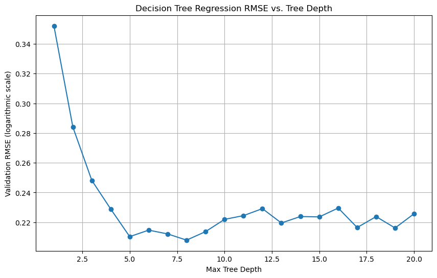

**Random Forest Regressor Model**
```ruby
# Load data
train_df = pd.read_csv('train.csv')
test_df = pd.read_csv('test.csv')

# Prepare data
imputer = SimpleImputer(strategy='mean')
X = train_df.select_dtypes(include=[np.number]).drop(['Id', 'SalePrice'], axis=1)
y = train_df['SalePrice']
X_train, X_val, y_train, y_val = train_test_split(X, y, test_size=0.2, random_state=42)

# Imputing missing values
X_train = imputer.fit_transform(X_train)
X_val = imputer.transform(X_val)
X_test = imputer.transform(test_df.select_dtypes(include=[np.number]).drop(['Id'], axis=1))

# Model training with varying number of trees
n_estimators_options = [10, 50, 100, 200, 300, 400, 500]
rmse_values = []

for n_estimators in n_estimators_options:
    model = RandomForestRegressor(n_estimators=n_estimators, random_state=42, oob_score=True)
    model.fit(X_train, y_train)
    predictions_val = model.predict(X_val)
    log_rmse = np.sqrt(mean_squared_error(np.log(y_val), np.log(predictions_val)))
    rmse_values.append(log_rmse)
    print(f'Validation RMSE with {n_estimators} trees: {log_rmse}')

# Plotting RMSE vs. Number of Trees
plt.figure(figsize=(10, 6))
plt.plot(n_estimators_options, rmse_values, marker='o')
plt.xlabel('Number of Trees')
plt.ylabel('Validation RMSE (logarithmic scale)')
plt.title('Random Forest RMSE vs. Number of Trees')
plt.grid(True)
plt.show()

# Continue with the optimal number of trees
optimal_trees = n_estimators_options[rmse_values.index(min(rmse_values))]
model = RandomForestRegressor(n_estimators=optimal_trees, random_state=42)
model.fit(X_train, y_train)

# Predictions for final evaluation
final_predictions_val = model.predict(X_val)
final_log_rmse = np.sqrt(mean_squared_error(np.log(y_val), np.log(final_predictions_val)))
print(f'Final Model Validation RMSE (logarithmic scale): {final_log_rmse}')

# Prediction on test set
final_predictions = model.predict(X_test)

# Save to CSV
submission = pd.DataFrame({'Id': test_df['Id'], 'SalePrice': final_predictions})
submission.to_csv('submission_forest_regressor.csv', index=False)

Validation RMSE with 10 trees: 0.1662343720459083
Validation RMSE with 50 trees: 0.1553413724657581
Validation RMSE with 100 trees: 0.15472731915872182
Validation RMSE with 200 trees: 0.15538547182882992
Validation RMSE with 300 trees: 0.15488222094537213
Validation RMSE with 400 trees: 0.15460513670456424
Validation RMSE with 500 trees: 0.15461358292100666
```

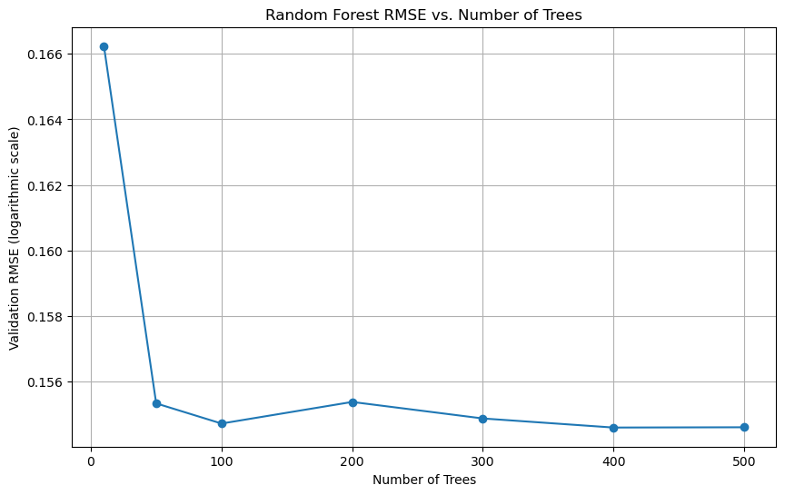

**Support Vector Regression (SVR) Model**
```ruby
# Load data
train_df = pd.read_csv('train.csv')
test_df = pd.read_csv('test.csv')

# Prepare data
imputer = SimpleImputer(strategy='mean')
scaler = StandardScaler()
X = train_df.select_dtypes(include=[np.number]).drop(['Id', 'SalePrice'], axis=1)
y = train_df['SalePrice']
X_train, X_val, y_train, y_val = train_test_split(X, y, test_size=0.2, random_state=42)

# Imputing missing values and scaling
X_train = scaler.fit_transform(imputer.fit_transform(X_train))
X_val = scaler.transform(imputer.transform(X_val))
X_test = scaler.transform(imputer.transform(test_df.select_dtypes(include=[np.number]).drop(['Id'], axis=1)))

# Model training with varying C values
C_values = np.logspace(-2, 2, 10)  # C values from 0.01 to 100 on a logarithmic scale
rmse_values = []

for C in C_values:
    model = SVR(C=C)
    model.fit(X_train, y_train)
    predictions_val = model.predict(X_val)
    log_rmse = np.sqrt(mean_squared_error(np.log(y_val), np.log(predictions_val)))
    rmse_values.append(log_rmse)
    print(f'Validation RMSE with C={C}: {log_rmse}')

# Plotting RMSE vs. C values
plt.figure(figsize=(10, 6))
plt.semilogx(C_values, rmse_values, marker='o')
plt.xlabel('C (Regularization parameter)')
plt.ylabel('Validation RMSE (logarithmic scale)')
plt.title('SVR RMSE vs. Regularization Parameter C')
plt.grid(True)
plt.show()

# Continue with the optimal C value
optimal_C = C_values[rmse_values.index(min(rmse_values))]
model = SVR(C=optimal_C)
model.fit(X_train, y_train)

# Final predictions
final_predictions_val = model.predict(X_val)
final_predictions = model.predict(X_test)

# Final RMSE calculation
final_log_rmse = np.sqrt(mean_squared_error(np.log(y_val), np.log(final_predictions_val)))
print(f'Final Model Validation RMSE (logarithmic scale): {final_log_rmse}')

# Save to CSV
submission = pd.DataFrame({'Id': test_df['Id'], 'SalePrice': final_predictions})
submission.to_csv('submission_svr.csv', index=False)

Validation RMSE with C=0.01: 0.43228288619351873
Validation RMSE with C=0.027825594022071243: 0.4322771977527251
Validation RMSE with C=0.0774263682681127: 0.4322613912791919
Validation RMSE with C=0.21544346900318834: 0.43221741006922215
Validation RMSE with C=0.5994842503189409: 0.43209503936337396
Validation RMSE with C=1.6681005372000592: 0.43175461034100365
Validation RMSE with C=4.6415888336127775: 0.43081992120251567
Validation RMSE with C=12.915496650148826: 0.4281888182606385
Validation RMSE with C=35.93813663804626: 0.42111674893938306
Validation RMSE with C=100.0: 0.4021488535203938
```

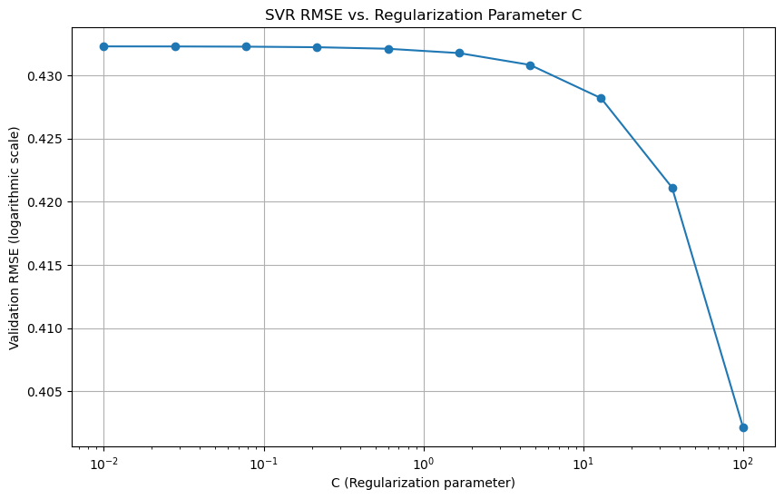

**K-Nearest Neighbors Regressor Model**
```ruby
# Load data
train_df = pd.read_csv('train.csv')
test_df = pd.read_csv('test.csv')

# Prepare data
imputer = SimpleImputer(strategy='mean')
scaler = MinMaxScaler()
X = train_df.select_dtypes(include=[np.number]).drop(['Id', 'SalePrice'], axis=1)
y = train_df['SalePrice']
X_train, X_val, y_train, y_val = train_test_split(X, y, test_size=0.2, random_state=42)

# Imputing missing values and scaling
X_train = scaler.fit_transform(imputer.fit_transform(X_train))
X_val = scaler.transform(imputer.transform(X_val))
X_test = scaler.transform(imputer.transform(test_df.select_dtypes(include=[np.number]).drop(['Id'], axis=1)))

# Initialize variables for plotting
neighbors_range = range(1, 21)  # Testing with 1 to 20 neighbors
rmse_values = []

# Model training with different numbers of neighbors
for n_neighbors in neighbors_range:
    model = KNeighborsRegressor(n_neighbors=n_neighbors)
    model.fit(X_train, y_train)
    predictions_val = model.predict(X_val)
    log_rmse = np.sqrt(mean_squared_error(np.log(y_val), np.log(predictions_val)))
    rmse_values.append(log_rmse)
    print(f'Validation RMSE with {n_neighbors} neighbors: {log_rmse}')

# Plotting RMSE vs. Number of Neighbors
plt.figure(figsize=(10, 6))
plt.plot(neighbors_range, rmse_values, marker='o')
plt.xlabel('Number of Neighbors')
plt.ylabel('Validation RMSE (logarithmic scale)')
plt.title('KNN Regression RMSE vs. Number of Neighbors')
plt.grid(True)
plt.show()

# Continue with the optimal number of neighbors
optimal_neighbors = neighbors_range[rmse_values.index(min(rmse_values))]
model = KNeighborsRegressor(n_neighbors=optimal_neighbors)
model.fit(X_train, y_train)

# Final predictions
final_predictions_val = model.predict(X_val)
final_predictions = model.predict(X_test)

# Final RMSE calculation
final_log_rmse = np.sqrt(mean_squared_error(np.log(y_val), np.log(final_predictions_val)))
print(f'Final Model Validation RMSE (logarithmic scale): {final_log_rmse}')

# Save to CSV
submission = pd.DataFrame({'Id': test_df['Id'], 'SalePrice': final_predictions})
submission.to_csv('submission_knn.csv', index=False)

Validation RMSE with 1 neighbors: 0.23405686642275
Validation RMSE with 2 neighbors: 0.21054217941447706
Validation RMSE with 3 neighbors: 0.20548274884018689
Validation RMSE with 4 neighbors: 0.2067920275398134
Validation RMSE with 5 neighbors: 0.20416957386690346
Validation RMSE with 6 neighbors: 0.20061281158254307
Validation RMSE with 7 neighbors: 0.20295044826961986
Validation RMSE with 8 neighbors: 0.2029950516485167
Validation RMSE with 9 neighbors: 0.20255122795744027
Validation RMSE with 10 neighbors: 0.2040287445662583
Validation RMSE with 11 neighbors: 0.2037839686424267
Validation RMSE with 12 neighbors: 0.2048289413952637
Validation RMSE with 13 neighbors: 0.20538864296318152
Validation RMSE with 14 neighbors: 0.20697870283827793
Validation RMSE with 15 neighbors: 0.2076969628884134
Validation RMSE with 16 neighbors: 0.20865707622585344
Validation RMSE with 17 neighbors: 0.20945931412209165
Validation RMSE with 18 neighbors: 0.20913361959366603
Validation RMSE with 19 neighbors: 0.20814051384155133
Validation RMSE with 20 neighbors: 0.21006424394023987
```

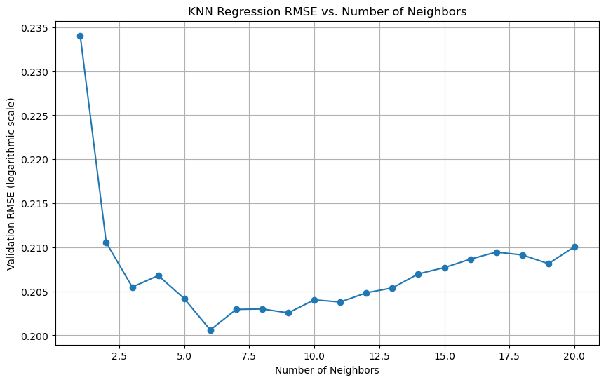

**Simple Average Blend**
```ruby
models = {
    "Lasso": Lasso(alpha=1.0, random_state=42),
    "RandomForest": RandomForestRegressor(n_estimators=100, random_state=42),
    "GradientBoosting": GradientBoostingRegressor(n_estimators=100, learning_rate=0.1, max_depth=3, random_state=42),
    "LinearRegression": LinearRegression(),
    "DecisionTree": DecisionTreeRegressor(random_state=42),
    "SVR": SVR(),
    "KNN": KNeighborsRegressor(n_neighbors=5)
}

validation_predictions = []
test_predictions = []

for name, model in models.items():
    model.fit(X_train, y_train)
    # Collect predictions for validation set
    val_pred = model.predict(X_val)
    validation_predictions.append(val_pred)
    # Collect predictions for test set
    test_pred = model.predict(X_test)
    test_predictions.append(test_pred)

# Convert lists to numpy arrays for easier manipulation
validation_predictions = np.column_stack(validation_predictions)
test_predictions = np.column_stack(test_predictions)

final_predictions_simple_average = np.mean(validation_predictions, axis=1)
simple_blend_rmse = np.sqrt(mean_squared_error(np.log(y_val), np.log(final_predictions_simple_average)))
print(f"Validation RMSE for simple average blend: {simple_blend_rmse}")

final_test_predictions_simple_average = np.mean(test_predictions, axis=1)

blender = LinearRegression()
blender.fit(validation_predictions, y_val)
final_predictions_blender = blender.predict(validation_predictions)

blender_rmse = np.sqrt(mean_squared_error(y_val, final_predictions_blender))
print(f"Validation RMSE for linear regression blender: {blender_rmse}")

final_test_predictions_blender = blender.predict(test_predictions)

# Using simple average for submission
submission_simple = pd.DataFrame({'Id': test_df['Id'], 'SalePrice': final_test_predictions_simple_average})
submission_simple.to_csv('submission_simple_average.csv', index=False)

Validation RMSE for simple average blend: 0.16307987309213423
```

## Evaluation and Submissions

- **#1 Gradient Boosting Regressor:** Chosen for its ability to handle non-linear data and provide robust predictive power through ensemble learning. This is a powerful ensemble technique that builds multiple models sequentially, each new model correcting errors made by the previous ones. **The notebook explores different numbers of estimators to optimize performance. The use of RMSE as an evaluation metric helps demonstrate the impact of increasing complexity (more estimators) on model accuracy.**

- **#2 (tie) Lasso Regression:** Utilized for its ability to perform feature selection by shrinking the coefficients of less important features to zero. **This model uses L1 regularization to penalize the absolute size of coefficients. By varying the alpha parameter, which controls the strength of the regularization, the notebook shows how Lasso regression can prevent overfitting**, particularly in a dataset that may have multicollinearity or irrelevant features. The RMSE scores are computed to evaluate how well the model performs on unseen data.

- **#2 (tie) Random Forest Regressor:** Selected for its versatility and reliability, providing excellent results particularly in terms of handling a variety of data types and feature importance determination.

## Conclusion
This project successfully demonstrates the application of advanced machine learning techniques to real-world data. The models developed not only provide accurate predictions of house prices but also offer insights into the factors that most significantly affect residential property values.