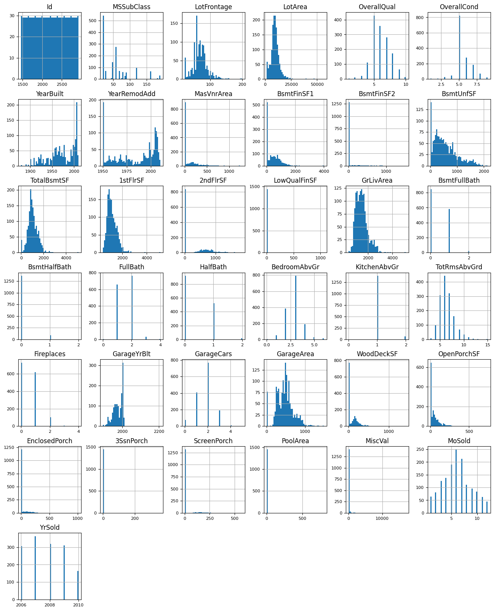

# --IN PROGRESS-- Project-4: House Price Prediction using various ML techniques :house_with_garden:	

<p align="center">
  
</p>

## Table of Contents
1. [Project Overview](#project-overview)
2. [Results Summary](#results-summary)
3. [Dataset](#dataset)
4. [Data Source](#data-source)
5. [Tech Stack](#tech-stack)
6. [Exploratory Data Analysis (EDA)](#exploratory-data-analysis-eda)
7. [Data Visualizations](#data-visualizations)
8. [Machine Learning Modeling](#machine-learning-modeling)
9. [Blending All Models](#blending-all-models)
10. [Evaluation and Submissions](#evaluation-and-submissions)
11. [Conclusion](#Conclusion)

## Project Overview
This project focuses on developing a predictive model for housing prices using various machine learning techniques. The primary goal is to **accurately predict house sales prices based on a comprehensive dataset that includes numerous features related to property characteristics** such as area, quality, condition, and location.

## Results Summary

Several models were explored and evaluated for their effectiveness in predicting house prices. 

**Key Results**
- **Model Comparison:** The models were evaluated based on the **Root Mean Square Error (RMSE)**, with the *Gradient Boosting, Lasso Regression and Random Forest models* showing particularly promising results.
- **Feature Importance:** Analysis revealed that certain features, such as *OverallQual and GrLivArea*, were highly predictive of house prices, guiding feature selection and engineering efforts.
- **Optimization:** **Parameter tuning was performed**, particularly for the *Random Forest and Gradient Boosting models*, to enhance model accuracy and efficiency.

## Performance Table

| **ML Technique**  | **RMSE Error** |
| ------------- | ------------- |
| Lasso Regression Model  | 0.1540  |
| Random Forest Model  | 0.1540  |
| Gradient Boosting Model  | 0.1431  |
| Linear Regression Model  | 0.1897  |
| Decision Tree Regressor Model  | 0.2103  |
| Random Forest Regressor Model  | 0.1546  |
| Support Vector Regression (SVR) Model  | 0.4021  |
| K-Nearest Neighbors Regressor Model  | 0.2006  |
| Simple Average Blend  | 0.1631  |

<p align="left">
  
</p>

### Model Summary with RMSE Error

1. **Gradient Boosting Model (0.1431):**
- **Performance:** Best performing model.
- **Interpretation:** This model has the lowest RMSE, indicating it has the best predictive accuracy among the models listed. Gradient Boosting effectively handles both linear and non-linear relationships by building an ensemble of weak prediction models, typically decision trees.

2. **Lasso Regression Model (0.1540):**
- **Performance:** Joint second best with Random Forest.
- **Interpretation:** Lasso (Least Absolute Shrinkage and Selection Operator) performs both variable selection and regularization to enhance the prediction accuracy. Its performance is strong, especially considering it helps in reducing overfitting in models with many features.

3. **Random Forest Model (0.1540) and Random Forest Regressor Model (0.1546):**
- **Performance:** Very close to Lasso, almost identical RMSE for one variant.
- **Interpretation:** Shows robust performance, slightly varied between implementations. Random Forest is effective due to its method of averaging multiple deep decision trees, trained on different parts of the same training set, which reduces overfitting and variance.

4. **Simple Average Blend (0.1631):**
- **Performance:** Mid-tier performance.
- **Interpretation:** This technique involves averaging the predictions of multiple models. It's a straightforward ensemble method that can yield decent results by blending different model outputs, reducing variance but not always capturing complex patterns effectively.

5. **Linear Regression Model (0.1897):**
- **Performance:** Lower middle performance.
- **Interpretation:** Shows moderate predictive power. Linear regression assumes a linear relationship between features and the target variable, which might not always hold true in complex datasets like house pricing, explaining the higher RMSE.

6. **K-Nearest Neighbours Regressor Model (0.2006):**
- **Performance:** Lower performance.
- **Interpretation:** This model uses feature similarity to predict values of new data points, which indicates it may struggle with high dimensional data or where feature scaling is not adequately managed.

7. **Decision Tree Regressor Model (0.2103):**
- **Performance:** Lower performance among tree-based models.
- **Interpretation:** Prone to overfitting, especially without adequate depth constraints or pruning. Decision Trees can capture complex patterns but often don’t generalize well.

8. **Support Vector Regression (SVR) Model (0.4021):**
- **Performance:** Worst performance.
- **Interpretation:** This model, especially with default settings, may not perform well with large data sets or when features influencing the target are nonlinear. Its high RMSE suggests that it might not have captured the complex relationships in the data effectively.

## Dataset
The datasets utilized in this project contains detailed information on residential home sales reported in **Ames, Iowa**. Datasets are broken up into two parts: **train and test**.

### 1. Train Dataset Analysis

**The train.csv dataset includes data on 1,460 properties, described by 81 features.** Here are some key insights and observations:

**General Structure**
- **Total Entries:** 1,460
- **Total Features:** 81, including a wide range of property characteristics such as zoning, lot size, street type, building type, quality and condition ratings, and many more detailed attributes related to the property’s interior and exterior.

**Notable Features**
- **SalePrice:** The target variable for prediction, with values ranging from **$34,900 to $755,000**, and a mean of approximately **$180,921**.

- **MSSubClass, MSZoning, and Neighborhood:** These features categorize properties by type, zoning, and location within Ames, Iowa.

- **YearBuilt and YearRemodAdd:** Indicating the age of the property and the last remodeling year.
- **OverallQual and OverallCond:** Rating scales from 1 to 10 that assess the overall material and finish quality, and the overall condition of the property.
- **TotalBsmtSF and GrLivArea:** Key area measurements in square feet for basement and above-ground living area.

**Categorical and Numeric Distribution**
- Many features are **categorical** (e.g., Street, LotShape, Utilities), requiring encoding for machine learning applications.
- **Numeric** data spans across discrete and continuous variables, with different scales and distributions, which may need standardization or normalization.

<p align="left">
  
</p>

### 2. Test Dataset Analysis

The test dataset includes data on **1,459 properties with the same 80 features** as in the train dataset (excluding *SalePrice*). Here are some key observations:

**General Structure**
- **Total Entries:** 1,459

- **Total Features:** 80 (one less than the train set due to the absence of the target variable SalePrice).

<p align="left">
  
</p>

### Summary and Insights 

Both the train and test datasets are quite consistent in terms of the types of features and data quality issues (e.g., missing values). **The test set lacks the SalePrice feature** since it's meant for making predictions in a typical modeling task.

**These are the features provide a nuanced view of each home's attributes, contributing significantly to the model's predictive capabilities.**

- **OverallQual**: Overall material and finish quality
- **GrLivArea**: Above grade (ground) living area square feet
- **GarageCars**: Size of garage in car capacity
- **TotalBsmtSF**: Total square feet of basement area
- **FullBath**: Full bathrooms above grade

<p align="center">
  
</p>

## Data Source
| Data Source  | Description |
| ------------- | ------------- |
| [House Prices - Advanced Regression Techniques](https://www.kaggle.com/competitions/house-prices-advanced-regression-techniques)  | Predict sales prices and practice feature engineering, RFs, and gradient boosting  |

## Tech Stack
| Name  | Usage |
| ------------- | ------------- |
|  | Data manipulation and analysis  |
|  | Numerical computations  |
|  | 2D plotting  |
|  | Machine learning library   |
|  | Library for creating statistical graphics and visualizing data  |
|  | Visual analytics platform  |
|  | Hosted Jupyter Notebook service  |
|  | Presentation program  |
|  | Developer platform  |

## Exploratory Data Analysis (EDA)


```ruby
train_df.hist(figsize=(16, 20), bins=50, xlabelsize=8, ylabelsize=8, color='green');
```


```ruby
test_df.hist(figsize=(16, 20), bins=50, xlabelsize=8, ylabelsize=8);
```



## Data Visualizations

## Machine Learning Modeling
:

Lasso Regression: Utilized for its ability to perform feature selection by shrinking the coefficients of less important features to zero.
Gradient Boosting Regressor: Chosen for its ability to handle non-linear data and provide robust predictive power through ensemble learning.
Random Forest Regressor: Selected for its versatility and reliability, providing excellent results particularly in terms of handling a variety of data types and feature importance determination.
Key Results
Model Comparison: 
Feature Importance: Analysis revealed that certain features, such as OverallQual and GrLivArea, were highly predictive of house prices, guiding feature selection and engineering efforts.
Optimization: Parameter tuning was performed, particularly for the Random Forest and Gradient Boosting models, to enhance model accuracy and efficiency.

8 Machine Learning Algorithms were ran in this project.

- Supervised
    - Classification:
    - Regression: Linear Regression / Ridge / Lasso / ElasticNet
- Unsupervised
    - Clustering: ESupport Vector Machine
- Ensemble Methods
    - RandomForest / XGBoost / LGBM / CatBoost

## Blending All Models

## Evaluation and Submissions

## Conclusion
This project successfully demonstrates the application of advanced machine learning techniques to real-world data. The models developed not only provide accurate predictions of house prices but also offer insights into the factors that most significantly affect residential property values.